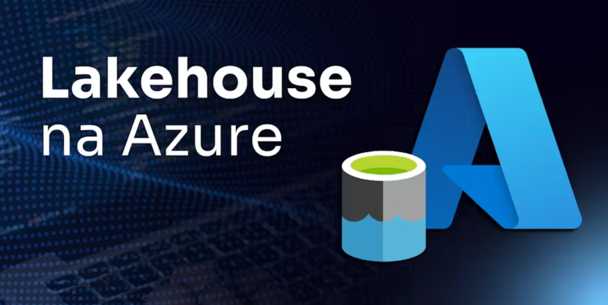
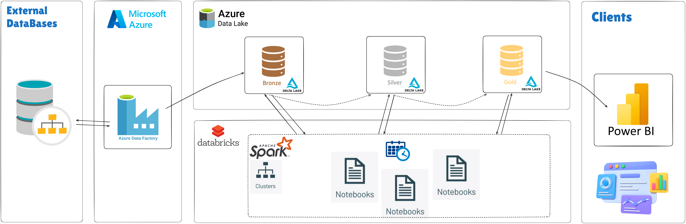
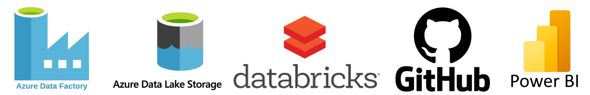
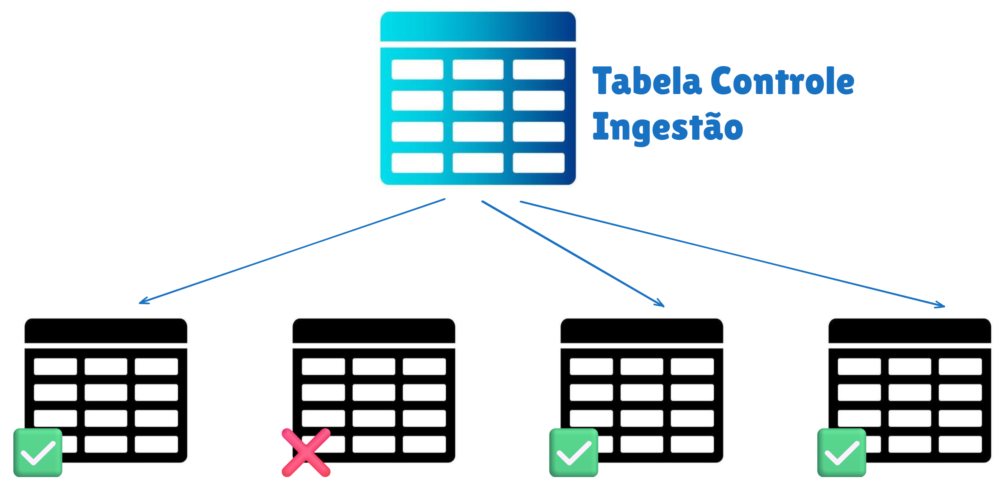
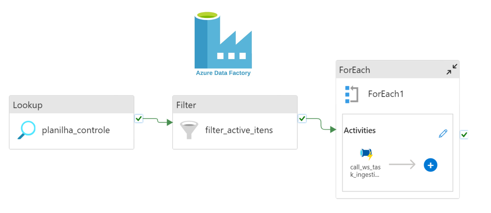
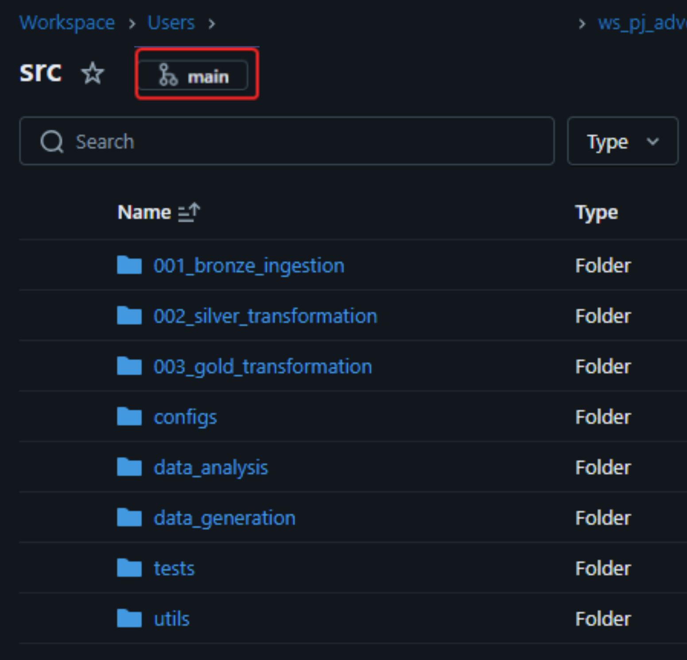
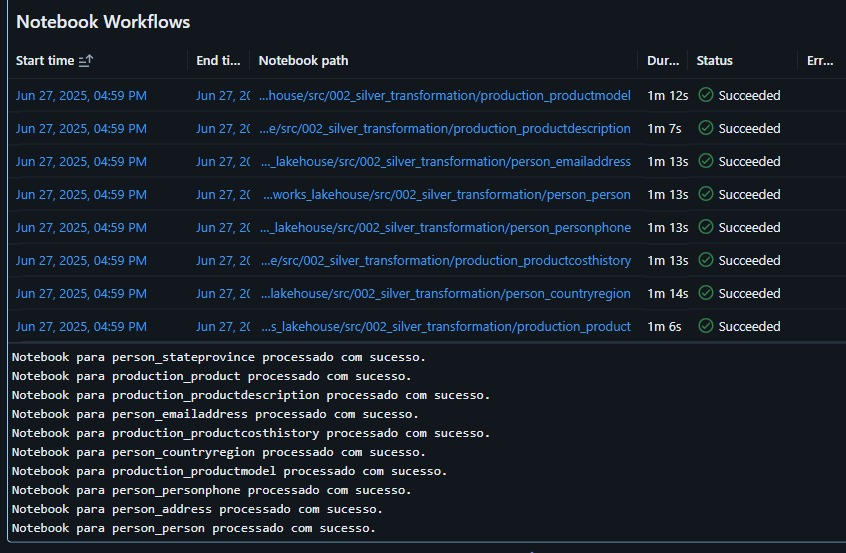

## 📌 Visão Geral do Projeto

Este projeto tem como objetivo construir uma pipeline de dados escalável e automatizada para uma empresa do setor de varejo, utilizando serviços gerenciados do Azure e adotando a arquitetura moderna Lakehouse (Bronze → Silver → Gold). A solução entrega dados prontos para análise em dashboards do Power BI, apoiando decisões estratégicas e operacionais do negócio.




### 🎯 Objetivos

- Ingestão automatizada de dados a partir de banco de dados relacional (Azure SQL Database)
- Armazenamento estruturado em camadas no Azure Data Lake com Delta Parquet
- Processamento e transformação de dados com Azure Databricks
- Orquestração via Azure Data Factory
- Governança e versionamento via GitHub com integração CI/CD
- Criação de tabelas agregadas para visualização analítica com Power BI

### 🧰 Tecnologias Utilizadas


- ✅ **Azure Data Factory (ADF)**  orquestração e ingestão de dados
- ✅ **Azure Data Lake Storage Gen2 (ADLS)**  armazenamento em camadas
- ✅ **Azure Databricks**  processamento distribuído e notebooks de transformação
- ✅ **Azure Key Vault**  gerenciamento seguro de segredos
- ✅ **GitHub**  versionamento e CI/CD dos notebooks
- ✅ **Power BI**  visualização de dados e relatórios analíticos

<br>



<br>

## 🗂️ Arquitetura e Fluxo de Dados

A arquitetura adotada segue o padrão medalhão Lakehouse, separando o armazenamento e processamento de dados em três camadas: Bronze (Raw), Silver (Curated) e Gold (Business). A orquestração da ingestão é feita com Azure Data Factory e o processamento com **Azure Databricks** processamento de dados com spark.

### 🔁 Ingestão (ADF → Bronze)

A ingestão é realizada de forma automatizada e parametrizada a partir de uma planilha de controle. Nessa planilha, defino quais tabelas estão ativas para ingestão, permitindo ativar ou desativar facilmente tabelas no pipeline conforme a necessidade.

 



<br>

###  Data Factory: Copy Activity e ForEach

1. Criei uma atividade de cópia full (toda tabela) que recebe parâmetros e extrai dados diretamente do Azure SQL Database para arquivos .parquet na camada Bronze, utilizando inferência automática de schema.

2. Implementei uma consulta SQL que filtra apenas as tabelas marcadas como ativas para ingestão na tabela de controle.

3. Configurei um loop ForEach que itera sobre cada tabela ativa e, para cada uma, executa a atividade de cópia correspondente, passando os parâmetros de forma dinâmica.

<br>



<br>

## 📁 Estrutura de pastas do Projeto e Integração com GitHub

O projeto segue uma estrutura modular de diretórios, separando claramente cada etapa da pipeline (ingestão, transformação e análise). Além disso, foram criadas pastas auxiliares para configurações, testes e geração de dados sintéticos.

### 📂 Organização de Diretórios

```bash
src/
├── 001_bronze_ingestion/         # Notebooks de ingestão de dados brutos (ADF → ADLS)
├── 002_silver_transformation/    # Notebooks para tratamento e limpeza dos dados
├── 003_gold_transformation/      # Notebooks para aplicação de regras de negócio e KPIs
├── configs/                      # Configurações globais e notebooks de setup
├── data_analysis/                # Scripts e notebooks exploratórios para análises
├── data_generation/              # Scripts para gerar dados de exemplo ou mockados
├── tests/                        # Testes unitários e de validação de dados
├── utils/                        # Funções reutilizáveis e helpers
└── README.md                     # Documentação do projeto
```

### 🔗 Integração com GitHub

O repositório do projeto foi integrado ao **Databricks** via GitHub, permitindo versionamento de todo o código (notebooks) e colaboração eficiente entre os desenvolvedores. 
Cada notebook é mantido no formato de arquivo .py com as marcações do Databricks ``(%md, %sql, %python)``, garantindo compatibilidade com o GitHub e possibilitando a automação CI/CD.


#### ✅ Exemplo de uso via UI do Databricks:

1. Vá em **Repos** → **Git** → **GitHub**
2. Selecione o repositório e branch desejado
3. Trabalhe com controle de versão diretamente do ambiente do Databricks



<br>

## 🖥️ Cluster Utilizado

O projeto foi desenvolvido utilizando um cluster Databricks com a seguinte configuração:

| Configuração           | Valor                                |
|------------------------|-------------------------------       |
| **Databricks Runtime** | 15.4 LTS (Spark 3.5.0, Scala 2.12)   |
| **Node Type**          | Standard_DS3_v2                      |
| **Memória / CPU**      | 14 GB RAM / 4 Cores                  |
| **Tipo de Cluster**    | Single Node                          |

<br>

## 🛡️ Montagem do Data Lake com Secret Scope

Antes de iniciar o processamento, montei o sistema de arquivos do **Azure Data Lake Storage Gen2 (ADLS)** no Databricks, utilizando autenticação OAuth 2.0 via uma App Registration no Azure AD. Armazenei as credenciais sensíveis no **Azure Key Vault** e as disponibilizei no Databricks por meio de um Secret Scope chamado `ws_adb_secret_scope`.

O procedimento de montagem está implementado no notebook  `src/configs/mount_data_lake.py`

#### 🔐 Exemplo de leitura dos segredos e montagem do Data Lake

```python
# Obter segredos do Key Vault via dbutils
client_id     = dbutils.secrets.get('ws_adb_secret_scope', 'client-id')
tenant_id     = dbutils.secrets.get('ws_adb_secret_scope', 'tenant-id')
client_secret = dbutils.secrets.get('ws_adb_secret_scope', 'client-secret')

# Exemplo de implementação de montagem do container no Data Lake
    if  montar_mount_point:
        dbutils.fs.mount(
            source=f"abfss://{container_name}@{storage_acount_name}.dfs.core.windows.net/",
            mount_point=mount_point,
            extra_configs=configs)
    else:
        print(f"O container já está montado: {mount_point}")
```

<br>

## 🧱 Criação dos Databases no Databricks

Depois de montar o Data Lake, criei três databases no metastore do Databricks para organizar os dados de acordo com as camadas Bronze, Silver e Gold.

O notebook `create_databases` localizado na pasta `src/configs/` contém os comandos SQL responsáveis por essa etapa.

#### 📦 Estrutura dos databases

- `adventure_works_bronze` → Dados brutos ingeridos diretamente da fonte
- `adventure_works_silver` → Dados tratados e normalizados
- `adventure_works_gold` → Dados agregados prontos para análise

#### Criação dos databases

```sql
-- Seleciona o metastore
USE CATALOG hive_metastore;

-- Cria database Bronze
CREATE DATABASE IF NOT EXISTS adventure_works_bronze
LOCATION '/mnt/wsadlsadwprd/adw/001_bronze/adventure_works_bronze';

-- Cria database Silver
CREATE DATABASE IF NOT EXISTS adventure_works_silver
LOCATION '/mnt/wsadlsadwprd/adw/001_silver/adventure_works_silver';

-- Cria database Gold
CREATE DATABASE IF NOT EXISTS adventure_works_gold
LOCATION '/mnt/wsadlsadwprd/adw/001_gold/adventure_works_gold';
```

<br>

## 🔄️ Processamento para a Camada Bronze

Após a ingestão dos dados via Azure Data Factory, os arquivos `.parquet` ficam disponíveis na camada **Bronze** do Data Lake. A partir disso, criei um notebook no Databricks para automatizar o registro desses dados como tabelas no metastore do Databricks.

O código responsável por essa etapa está no notebook: `src/001_bronze_ingestion/bronze_processing.py`

#### 🔁 Estratégia de Processamento

- Desenvolvi a função `generate_ingestion_dict()`, que percorre os diretórios do Data Lake e gera dinamicamente um dicionário com todos os arquivos a serem processados.
- Para cada entrada nesse dicionário, a função `ingest_bronze_and_save()` registra a tabela correspondente no database adventure_works_bronze, utilizando o formato `parquet`.
- Implementei a ``execução em paralelo`` utilizando ``ThreadPoolExecutor`` para otimizar o tempo de processamento, mesmo em um cluster com recursos limitados.

#### 📌 Exemplo representativo

```python
# Caminho e database alvo
folders_path = '/mnt/wsadlsadwprd/adw/001_bronze'
database_name = 'hive_metastore.adventure_works_bronze'

# Geração dinâmica do dicionário com todos arquivos do container bronze
tables_ingestion_dic = generate_ingestion_dict(folders_path)

# Processamento paralelo com até 10 threads
with ThreadPoolExecutor(max_workers=10) as executor:
    for table_info in tables_ingestion_dic.values():
        executor.submit(process_table, table_info)
```

- ✅ Com essa abordagem, todas as tabelas da Bronze são catalogadas automaticamente no metastore, com ingestão paralela e tratamento de erros em tempo de execução.

<br>

## 🔄️ Transformações na Camada Silver

Desenvolvi notebooks de transformação individuais para cada tabela da camada Silver, aplicando regras específicas de qualidade, limpeza e conformidade de schema em cada conjunto de dados. Essa separação por tabela garante modularidade, rastreabilidade e facilidade de manutenção.

Esses notebooks de transformação Silver estão organizados na pasta: `src/002_silver_transformation/`

#### 🔍 Tabela: `person_emailaddress`

Notebook: `person_emailaddress.py`

- Realizei a substituição de valores nulos nas colunas ``rowguid`` (gerando um UUID) e ``ModifiedDate`` (usando o timestamp atual).
- Removi registros duplicados com base nas chaves ``BusinessEntityID`` e ``EmailAddressID``, utilizando uma janela ``ROW_NUMBER()`` ordenada pela data de modificação.
- Validei o schema dos dados por meio de um ``StructType`` explícito.
- Apliquei conversões de tipo (``cast``) para garantir os tipos de dados corretos em cada coluna.
- Implementei um upsert para refletir também exclusões (``DELETE``), utilizando a função ``_upsert_silver_table``.


📌  Implementei todas as transformações acima em **PySpark**, reutilizando funções centralizadas no módulo ``common_functions`` para promover reuso e padronização.


### ⚙️ Orquestração da Camada Silver

Para orquestrar a execução dos notebooks da camada Silver de forma automatizada, criei um dicionário que mapeia o nome de cada tabela ao caminho do seu notebook correspondente. Com esse dicionário, controlo de forma flexível quais notebooks serão executados.

#### 🗂️ Dicionário de Execução

```python
dict_tables = {
    "person_address": {
        "active": 1,
        "notebook_path": "person_address"
    },
    "person_countryregion": {
        "active": 1,
        "notebook_path": "person_countryregion"
    },
    ...
    ...
}
```

Cada entrada no dicionário representa uma tabela e aponta para o notebook de transformação correspondente (por exemplo: ``src/002_silver_transformation/{notebook_path}.py)``.

🚀 Execução Paralela dos Notebooks

Para melhorar a performance, implementei a execução paralela dos notebooks ativos utilizando ``ThreadPoolExecutor``. Com isso, as transformações ocorrem de forma simultânea, respeitando o número de workers definido no cluster.

```python
# Submissão dos notebooks ativos
with ThreadPoolExecutor(max_workers=10) as executor:
    futures = {
        executor.submit(run_notebook, config): table
        for table, config in dict_tables.items()
        if config['active'] == 1
    }
```

Implementei a função run_notebook() para encapsular a chamada dos notebooks e o tratamento de exceções, garantindo maior resiliência durante o processo.

✅ Essa abordagem permite adicionar, remover ou pausar notebooks facilmente, alterando apenas o dicionário — sem necessidade de reescrever o pipeline.





<br>

## 🔄️ Camada Gold: Transformações Analíticas

A camada ``Gold`` consolida os dados tratados da Silver em tabelas dimensionais e factuais, prontas para análise e visualização. Essas tabelas seguem o modelo de Data Warehouse (esquema estrela) e representam entidades de negócio, como clientes, produtos, vendas e promoções.

Os notebooks dessa camada estão organizados na pasta ``src/003_gold_transformation/``.

#### 🔧 Exemplo: `DimProduct`

Notebook: `DimProduct.py`

- Realizei junções entre tabelas de produtos, categorias, subcategorias e modelos.
- Removi duplicatas em cada dimensão utilizando uma janela ordenada por ModifiedDate.
- Gerei uma tabela dimensional de produtos com os principais atributos, pronta para análise.
- Validei o schema e salvei os dados no formato Delta (tabela pronta para consulta).

#### 📈 Exemplo: `FactInternetSales`

Notebook: `FactInternetSales.py`

- Une pedidos, clientes, ofertas, territórios e histórico de custo
- Aplica deduplicação por IDs e filtra apenas pedidos online
- Calcula colunas derivadas como `LineTotal`, `DiscountAmount` e `TotalProductCost`
- Verifica integridade (ex: quantidade e preço maiores que zero)
- Valida o schema esperado e grava a tabela fato


### ⚙️ Orquestração Paralela da Gold

Assim como na Silver, implementei a execução dos notebooks da Gold de forma paralela, utilizando um dicionário para especificar os notebooks ativos e seus respectivos caminhos.

```python
dict_tables = {
    "DimProduct": {
        "active": 1,
        "notebook_path": "DimProduct"
    },
    ...
}
```

✅ Com isso, a camada Gold entrega dados modelados e confiáveis para análises de performance, vendas, comportamento do cliente e outras visões estratégicas do negócio.


## 📘 Aprendizados do Projeto

Ao longo deste projeto, eu consolidei e apliquei conhecimentos essenciais em engenharia de dados, destacando-se:

- **Arquitetura Lakehouse**: Estruturei as camadas Bronze, Silver e Gold, compreendendo na prática os benefícios da separação entre ingestão bruta, tratamento e disponibilização analítica dos dados.

- **Orquestração e paralelismo**: Utilizei paralelismo com `ThreadPoolExecutor` e orquestração com Azure Data Factory para melhorar a performance e escalabilidade do pipeline no Databricks.

- **Integração CI/CD com GitHub**: Implementei pipelines de CI/CD com ``versionamento`` dos notebooks (``.py``) via ``GitHub``, garantindo automação de deploys, rastreabilidade de mudanças e colaboração entre equipes.

- **Segurança com Secret Scopes**: Adotei o Azure Key Vault e Databricks Secret Scopes para proteger credenciais, promovendo boas práticas de segurança em ambientes de produção.

- **Organização modular**: Estruturei os notebooks de forma clara e reutilizável por domínio, com funções comuns centralizadas em módulos auxiliares, facilitando a manutenção e evolução do projeto.

- **Depuração e performance**: Enfrentei e superei desafios relacionados a ``schemas``, performance e erros de execução, o que aprimorou minha capacidade de troubleshooting, validação de dados e otimização de transformações.

Essas experiências reforçaram minha capacidade técnica e prática na construção de pipelines robustos, seguros e escaláveis com Databricks e Azure.


